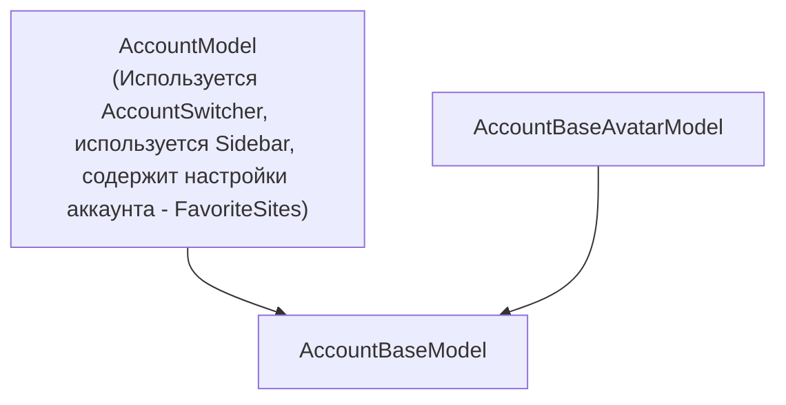
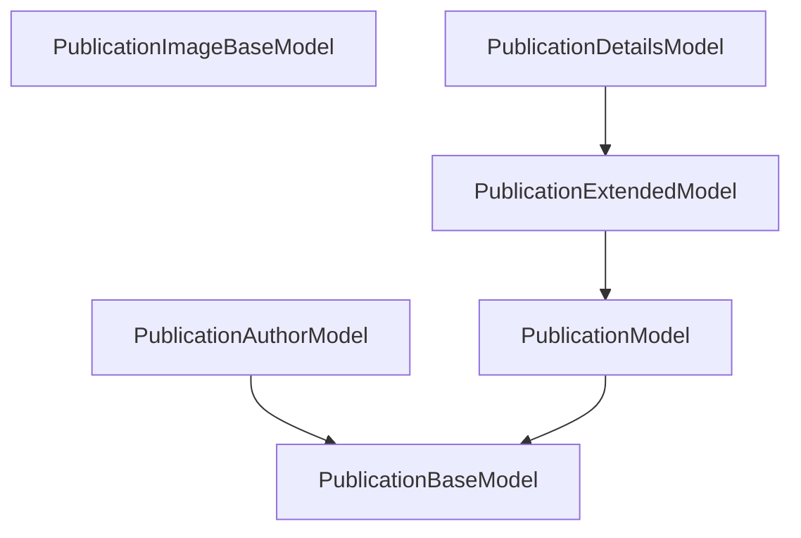
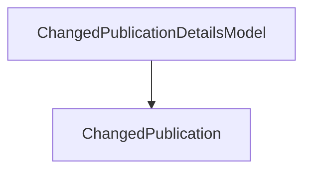
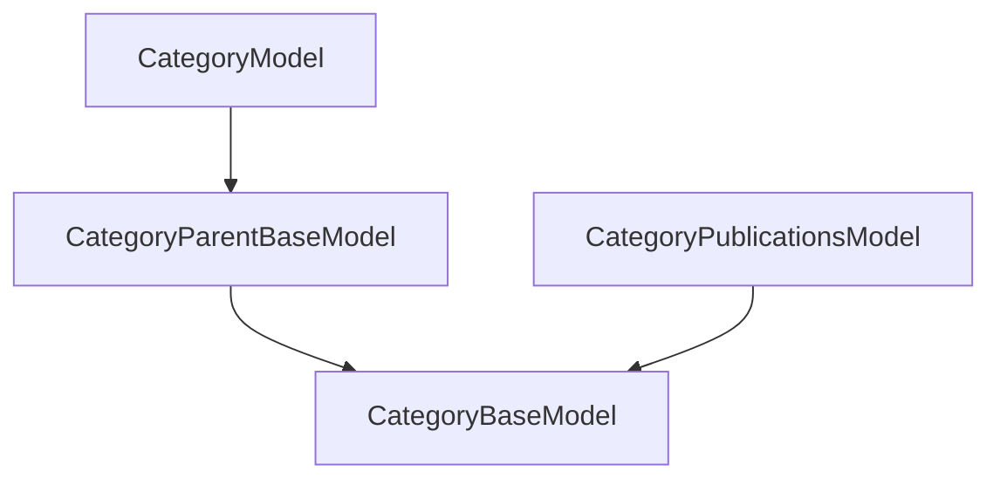
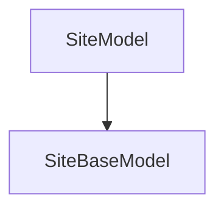

yarn install
yarn dev

## Pages

### SitesPage

### SitePage

### CategoryPage

### PublicationPage

## Assets sizes

| Tailwind size (px): | Tailwind postfix: | Asset postfix: |
| ------------------- | ----------------- | -------------- |
| 14                  | xxs               | 2xs            |
| 16                  | xs                | xs             |
| 20                  | sm                | sm             |
| **24**              | **base**          | **md**         |
| 28                  | lg                |                |
| 32                  | xl                |                |
| 36                  | 2xl               |                |
| 40                  |                   | 3xl            |
| 44                  |                   |                |
| 64                  | 9xl               | 9xl            |
| 72                  | 10xl              | 10xl           |
| 76                  |                   |                |

text-xs font-size: 0.75rem; /_ 12px _/
text-sm font-size: 0.875rem; /_ 14px _/
text-base font-size: 1rem; /_ 16px _/
text-lg font-size: 1.125rem; /_ 18px _/
text-xl font-size: 1.25rem; /_ 20px _/
text-2xl font-size: 1.5rem; /_ 24px _/
text-3xl font-size: 1.875rem; /_ 30px _/
text-4xl font-size: 2.25rem; /_ 36px _/
text-5xl font-size: 3rem; /_ 48px _/
text-6xl font-size: 3.75rem; /_ 60px _/
text-7xl font-size: 4.5rem; /_ 72px _/
text-8xl font-size: 6rem; /_ 96px _/
text-9xl font-size: 8rem; /_ 128px _/

## Classes hierarchy

### Account

### Publication

### ChangedPublication

### Category

### Site

### Operation

```mermaid
classDiagram
    Operation <|-- FairOperation

    FairOperation <|-- AccountAvatarChange
    FairOperation <|-- AccountNicknameChange
    FairOperation <|-- FavoriteSiteChange

    FairOperation <|-- AuthorAvatarChange
    FairOperation <|-- AuthorCreation
    FairOperation <|-- AuthorLinksChange
    FairOperation <|-- AuthorNicknameChange
    FairOperation <|-- AuthorTextChange
    FairOperation <|-- AuthorRenewal
    FairOperation <|-- AuthorModerationReward
    FairOperation <|-- AuthorOwnerAddition
    FairOperation <|-- AuthorOwnerRemoval

    FairOperation <|-- FileCreation
    FairOperation <|-- FileDeletion

    FairOperation <|-- ProductCreation
    FairOperation <|-- ProductDeletion
    FairOperation <|-- ProductUpdation

    FairOperation <|-- PerpetualVoting

    FairOperation <|-- ProposalCreation
    FairOperation <|-- ProposalVoting
    FairOperation <|-- ProposalCommentCreation
    FairOperation <|-- ProposalCommentEdit

    FairOperation <|-- SiteCreation
    FairOperation <|-- SiteRenewal

    FairOperation <|-- SiteOperation
    SiteOperation <|-- SitePolicyChange
    SiteOperation <|-- VotableOperation

    VotableOperation <|-- CategoryAvatarChange
    VotableOperation <|-- CategoryCreation
    VotableOperation <|-- CategoryDeletion
    VotableOperation <|-- CategoryMovement
    VotableOperation <|-- CategoryTypeChange

    VotableOperation <|-- PublicationCreation
    VotableOperation <|-- PublicationDeletion
    VotableOperation <|-- PublicationPublish
    VotableOperation <|-- PublicationUpdation

    VotableOperation <|-- ReviewCreation
    VotableOperation <|-- ReviewEdit
    VotableOperation <|-- ReviewStatusChange

    VotableOperation <|-- SiteAuthorsChange
    VotableOperation <|-- SiteAvatarChange
    VotableOperation <|-- SiteModeratorAddition
    VotableOperation <|-- SiteModeratorRemoval
    VotableOperation <|-- SiteNicknameChange
    VotableOperation <|-- SiteTextChange

    VotableOperation <|-- UserDeletion
    VotableOperation <|-- UserRegistration
```

## Z-Index

50 - fullscreen modal
60 - Modal backdrop
61 - <Modal />

## Links

General:

- [https://habr.com/ru/articles/754878/](https://habr.com/ru/articles/754878/)
